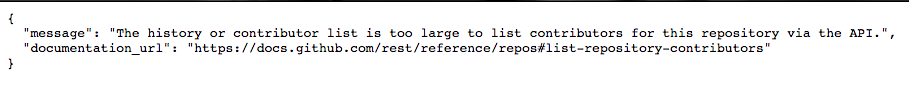
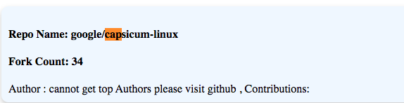

# Repofinder

Repofinder is a webapplication which can find top n repositories(based on the fork count) and their top m contributors(based on their commits count) of your favourite organization on github  

Click to chekout the website -> [](http://ec2-54-172-43-19.compute-1.amazonaws.com:8080/)

### How to set it up locally on your machine
You should have nodejs and npm installed in your machine. [click here](http://daringfireball.net/projects/markdown/) if you haven't already.
Before running the application you need to register the application and get the client_id and secret_key.

Register your application :
  - [click here](https://github.com/settings/applications/new)
  - Enter the Application Name, e.g. "Repofinder"
  - Enter Homepage URL as "http://localhost:8080/"
  - Enter Authorization callback URL as "http://localhost:8080/github/callback"
  - Save the Client ID and Client secret, it will be needed later
  
Steps :
  - Clone this repository.
  - Open the terminal in the cloned repository directory
  - run ```npm install``` to install all the dependencies
  - Create a ".env" file in the cloned directory and store the Client ID and Client secret inside it as:
  ``` 
    GITHUB_CLIENT_ID = "Your_Client_Id"
    GITHUB_CLIENT_SECRET = "Your_Client_Secret"
  ```
  - run ```node index.js``` top start the server. The server will be listening on port 8080
  - open browser and go to "http://localhost:8080/"


### How to use it

You need to first click the "Authenticate" button this will generate the access token and you will be redirected to the form. Then you need to fill the form and click on "Search Repos". After few seconds you will be redirected to the home page and the result will be showed. To search again click on "Authenticate" button.


### Note:
- Some api calls return error. For example :
    To get the contributors of "https://github.com/google/capsicum-linux"
  https://api.github.com/repos/google/capsicum-linux/contributors shows
  
However this case is handled but it will not show the top contributors of that particular repository. For example.  


- For large value of N there will be longer waiting time because API is called for each repository to get the top contributors . Wait until you're redirected to the home page. It may take upto 3-4 minutes.
-  The client-id and secret key are required to make an authenticated api request. This is done because for unauthenticated requests, the rate limit allows for up to 60 requests per hour but for API requests using Basic Authentication or OAuth, you can make up to 5000 requests per hour. For more details [click here](https://developer.github.com/v3/)
-  I have taken the assumption that the input m i.e the number of top author for a particular repository cannot be more the 100.


